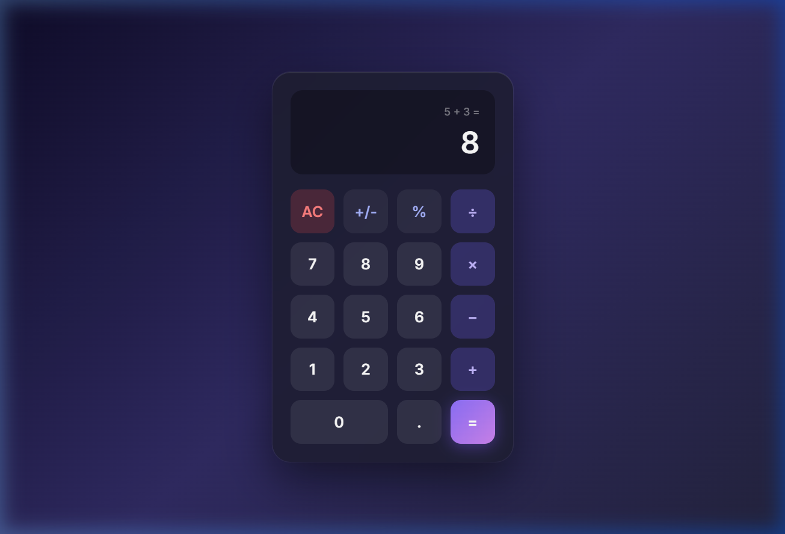

# Modern Dark Glassmorphism Calculator

A beautifully designed, fully functional calculator built with HTML, CSS, and vanilla JavaScript.

## Features
- **Modern UI:** Dark glassmorphism theme with smooth animations and hover effects.
- **Robust Logic:** Handles standard arithmetic, decimals, percentages, and sign toggling.
- **Keyboard Support:** Full keyboard accessibility (numbers, operators, Enter, Escape, Backspace).
- **Two-Line Display:** Clean visualization of both the ongoing mathematical expression and the current result.
